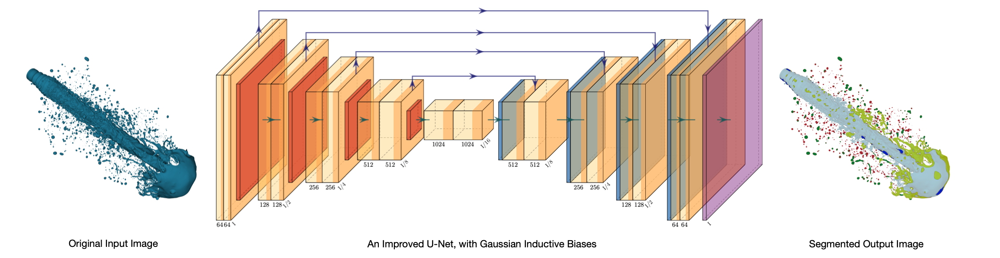
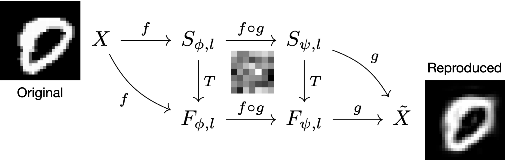

<table style="border:0;border-spacing:0;padding:0;">
   <tr style="border:0;border-spacing:0;padding:0;">
      <td width=160 style="vertical-align:top;border:0;border-spacing:0;padding:0;">
         
      </td>
      <td width=15 style="vertical-align:top;border:0;border-spacing:0;padding:0;">
      </td>
      <td width=auto style="vertical-align:top;border:0;border-spacing:0;padding:0">
         Matthew Teow 
         BSc MEng PhD, CEng MIET, PEng MIEM, SMIEEE 
         I am a lecturer at University Partnership (Coventry University), PSB Academy, Singapore with extensive interests in artificial intelligence and scientific computing.
   </tr>
</table>

Research Highlights 

Semantic Segmentation of Liquid Spray Images

      
   <a href="https://lynerlwl.github.io">Lyner Lim</a>, a PhD student under my co-supervision, has developed an improved U-Net algorithm. The algorithm applies Gaussian filtering on training data as an inductive bias to enhance the receptive sensitivity of convolutional feature learning in a U-Net. The objective is to perform a better semantic segmentation of liquid spray images in spray applications. The proposed Gaussian induction diffuses sharp edges into a regularised coarse edges at the contour boundaries. This maximizes the visibility of the contour boundary in the eyes of the receptive field of a convolutional feature extractor. Therefore, it allows the convolutional feature extractor in the U-Net to efficiently differentiate between the geometrical formation of the outward contour boundary and the inward contour boundary through a transitional pixel-level dissimilarity measure to confidently segment the detected contour into the correct class. The experimental results demonstrate the improved U-Net has outperformed the basic U-Net in segmenting the key droplets, an important requirement in spray applications.
     
   Related Publications: 
   [1] Semantic Liquid Spray Understanding with Computer-Generated Images, IEEE Access, IEEE, 2024. 
   [2] Performance Assessment of U-Net for Semantic Segmentation of Liquid Spray Images with Gaussian Blurring, ICOCO, IEEE, 2023.

Convolutional Learning: A Compositional Subspace Abstraction

      
   I started this project with the inspiration of my previous research in wavelet theory, specifically using discrete convolution to analyze visual information in dyadic wavelet structures for data compression. Then, I moved my research focus to convolutional neural networks for computer vision. When exploring convolutional neural networks and their visual feature learning capability, I thought of conceptualizing them with high-level mathematical abstraction. Perhaps, with a bit of learning from the fundamentals of cognition to guide the abstraction. I began working on subspace representation and functional composition to extend my understanding of convolutional visual learning in high-dimensional data analysis and low-dimensional data synthesis. That work progressed me from discriminative learning to generative autoencoding for visual feature extraction, modeling, and inference.  
   I was recently introduced to category theory and have embarked on a journey to learn it. It is motivating to know how this community sweats its effort to build a mathematical bridge between categories and artificial intelligence. I am slowly taking steps to learn more about categories and how they can conceptualize convolutional learning systems, be they visual, linguistic, or time series. I believe that category theory would enable me to create profound mathematical abstractions for the convolutional learning system that potentially incorporates the fundamentals of cognition. Then, I could (try to) utilize this knowledge to augment machine-level perceptions with new explainabilities and capabilities. The end-point outcomes of this research are still too early to judge, but I am excited about a promising and fulfilling journey waiting for me.
     
   Related Publications: 
   [1] Convolutional Autoencoder for Image Denoising: A Compositional Subspace Representation Perspective, IICAIET, IEEE, 2021. 
   [2] Experimenting Deep Convolutional Visual Feature Learning using Compositional Subspace Representation and Fashion-MNIST, IICAIET, IEEE, 2020. 
   [3] Convolutional Visual Feature Learning: A Compositional Subspace Representation Perspective, ICCV, ACM, 2018. 
   [4] Understanding Convolutional Neural Networks using A Minimal Model for Handwritten Digit Recognition, ICACIS, IEEE, 2017.

Publications 

Artificial Intelligence

   <b>Semantic Liquid Spray Understanding with Computer-Generated Images.</b> 
   Wei Lun Lim, Matthew Teow Yok Wooi, Richard Wong Teck Ken, Refat Khan Pathan, Chiung Ching Ho, Rahul Babu Koneru, Prashant Khare, Luis Bravo, and Sian Lun Lau. 
   IEEE Access, IEEE, 2024. 

   <b>Performance Assessment of U-Net for Semantic Segmentation of Liquid Spray Images With Gaussian Blurring.</b> 
   Wei Lun Lim, Matthew Teow Yok Wooi, Richard Wong Teck Ken, Refat Khan Pathan, Sian Lun Lau, Chiung Ching Ho, Luis Bravo, Rahul Babu Koneru, and Prashant Khare. 
   IEEE International Conference on Computing (ICOCO), Malaysia, 2023. 

   <b>mbeddingROUGE: Malay News Headline Similarity Evaluation.</b> 
   Puah Yeong Tsann, Kwang Hooi Yew, Mohd Fadzil Hassan, and Matthew Teow Yok Wooi. 
   International Conference on Digital Transformation and Intelligence (ICDI), Malaysia, 2022. 

   <b>Convolutional Autoencoder for Image Denoising: A Compositional Subspace Representation Perspective.</b> 
   Matthew Teow Yok Wooi. 
   IEEE International Conference on Artificial Intelligence in Engineering and Technology (IICAIET), Malaysia, 2021. 

   <b>Leading Sentence News Textrank.</b> 
   Puah Yeong Tsann, Kwang Hooi Yew, Mohd Fadzil Hassan, and Matthew Teow Yok Wooi. 
   International Conference on Intelligent Cybernetics Technology and Applications (ICICyTA), Malaysia, 2021. 

   <b>Experimenting Deep Convolutional Visual Feature Learning using Compositional Subspace Representation and Fashion-MNIST.</b> 
   Matthew Teow Yok Wooi. 
   IEEE International Conference on Artificial Intelligence in Engineering and Technology (IICAIET), Malaysia, 2020. 

   <b>Assessing Suitable Word Embedding Model for Malay Language Through Intrinsic Evaluation.</b> 
   Phua Yeong Tsann, Kwang Hooi Yew, Oi Mean Foong, and Matthew Teow Yok Wooi. 
   International Conference on Computational Intelligence (ICCI), Malaysia, 2020. 

   <b>Convolutional Visual Feature Learning: A Compositional Subspace Representation Perspective.</b> 
   Matthew Teow Yok Wooi. 
   ACM International Conference on Control and Computer Vision (ICCCV), Singapore, 2018. 

   <b>Understanding Convolutional Neural Networks using A Minimal Model for Handwritten Digit Recognition.</b> 
   Matthew Teow Yok Wooi. 
   IEEE International Conference on Automatic Control and Intelligent Systems (ICACIS), Malaysia, 2017. 

   <b>A Minimal Convolutional Neural Network for Handwritten Digit Recognition.</b> 
   Matthew Teow Yok Wooi. 
   IEEE International Conference on System Engineering and Technology (ICSET), Malaysia, 2017. 

   <b>Fuzzy Logic Temperature Control using Intel 80C196 Microcontroller.</b> 
   Matthew Teow Yok Wooi, Marzuki Khalid, and Rubiyah Yusof. 
   COSTAM National Science Congress, Malaysia, 1996. 

Data Compression

   <b>Performance Analysis of Wavelet Maxima Mapping Quantisation of Wavelet Image Lowpass Subband.</b> 
   Matthew Teow Yok Wooi. 
   IEEE International Colloquium on Signal Processing and Its Applications (ICSP), Malaysia, 2013. 

   <b>Wavelet Maxima Mapping Quantisation of Image Lowpass Subband and Its Statistical Measurements.</b> 
   Matthew Teow Yok Wooi. 
   IEEE International Conference on Control System, Computing and Engineering (ICCSCE), Malaysia, 2012. 

   <b>Wavelet Packet Image Arithmetic Coding Gain using Sub-Space Energy Feature Re-Mapping.</b> 
   Matthew Teow Yok Wooi, Lee Sze Wei, and Ian Chai. 
   MMU International Symposium on Information and Communication Technologies (M2USIC), Malaysia, 2006. 

   <b>Texture Images Compression using Wavelet Zerotree Energy Feature Re-Mapping.</b> 
   Matthew Teow Yok Wooi, Lee Sze Wei, and Ian Chai. 
   MMU International Symposium on Information and Communication Technologies (M2USIC), Malaysia, 2004. 

   <b>Adaptive Wavelet Zero-Tree Coding using Energy Feature Re-Mapping.</b> 
   Matthew Teow Yok Wooi, Lee Sze Wei, and Ian Chai. 
   MMU International Symposium on Information and Communication Technologies (M2USIC), Malaysia, 2003. 

   <b>Image Low-Pass Approximation Sub-Band Quantization with Wavelet Maxima Mapping Quantiser.</b> 
   Matthew Teow Yok Wooi, Lee Sze Wei, and Ian Chai. 
   IEE International Conference on Visual Information Engineering (VIE), UK, 2003. 

   <b>WMMQ for Image Low-Pass Approximation Subband Quantisation</b> 
   Matthew Teow Yok Wooi, Lee Sze Wei, and Ian Chai. 
   Multimedia University Research Poster Presentation, Malaysia, 2003. 

   <b>Analysis of Wavelet Transform on Spatial Domain Finite Length Signals Boundary Extension.</b> 
   Matthew Teow Yok Wooi and Rodney Tan. 
   Advances Technology Congress: Spatial and Computational Engineering (ATC), Malaysia, 2003. 

   <b>Wavelet Zero-Path Mapping Algorithm for Multimedia Image Coding.</b> 
   Matthew Teow Yok Wooi and Rodney Tan. 
   IEEE Malaysia National Conference on Telecommunication Technology (NCTT), Malaysia, 2003. 

   <b>Wavelet Maxima Mapping Quantiser for Image Low- Pass Approximation Sub-Band Coding.</b> 
   Matthew Teow Yok Wooi, Lee Sze Wei, and Ian Chai. 
   IEE Electronics Letters, IEE, 2003. 

   <b>Entropy Code Pre-Processing using Wavelet Sub-Space Energy Feature Re-Mapping.</b> 
   Matthew Teow Yok Wooi, Lee Sze Wei, and Ian Chai. 
   MMU International Symposium on Information and Communication Technologies (M2USIC), Malaysia, 2002. 

   <b>Wavelet Transform Modulus Maxima Analysis of Image Spatial Signal Discontinuities.</b> 
   Matthew Teow Yok Wooi, Lee Sze Wei, and Ian Chai. 
   MMU International Symposium on Information and Communication Technologies (M2USIC), Malaysia, 2001. 

   <b>Interpretation of Wavelet Sub-Band Energy Feature Compaction Properties and Its Spatial Information.</b> 
   Matthew Teow Yok Wooi, Lee Sze Wei, and Ian Chai. 
   MMU International Symposium on Information and Communication Technologies (M2USIC), Malaysia, 2000. 

Computational Modeling

   <b>Modelling of A Two-Stage Bidirectional AC-DC Converter using Wavelet Modulation.</b> 
   Chiu Hsiung Kee, Agileswari Ramasamy, Nadia Tan Mei Ling, and Matthew Teow Yok Wooi. 
   International Journal of Power Electronics and Drive Systems (IJPEDS), IAES, 2018. 

   <b>Simulation and Performance Study of A Horizontal Axis Wind Turbine Mechanical Power.</b> 
   Chiu Hsiung Kee, Matthew Teow Yok Wooi, Rodney Tan Hean Gay, Agileswari Ramasamy, and Nadia Tan Mei Ling. 
   National Graduate Conference (NATGRAD), Malaysia, 2017. 

   <b>Simulation and Performance Study of A Horizontal Axis Wind Turbine Mechanical Power.</b> 
   Chiu Hsiung Kee, Matthew Teow Yok Wooi, Rodney Tan Hean Gay, Agileswari Ramasamy, and Nadia Tan Mei Ling. 
   Journal of Energy and Environment, UNITEN, 2017. 

   <b>A Computational Modelling of Wind Turbine Mechanical Power and Its Improve Factor Determination.</b> 
   Matthew Teow Yok Wooi, Chiu Hsiung Khee, and Rodney Tan Hean Gay. 
   IET International Conference on Clean Energy and Technology (ICCT), Malaysia, 2016. 

   <b>A Comprehensive Modelling of Photovoltaic Module Characteristic Curve in MATLAB/Simulink.</b> 
   Rodney Tan Heng Gay and Matthew Teow Yok Wooi. 
   IET International Conference on Clean Energy and Technology (ICCT), Malaysia, 2016. 

   <b>Performance Evaluation of Horizontal Axis Wind Turbine Torque and Mechanical Power Generation Affected by The Number of Blades</b> 
   Rodney Tan Heng Gay and Matthew Teow Yok Wooi. 
   MATEC Web of Conferences 70, EDP Sciences, 2016. 

   <b>A Comprehensive Modeling, Simulation, and Computational Implementation of Buck Converter using MATLAB/Simulink.</b> 
   Rodney Tan Heng Gay and Matthew Teow Yok Wooi. 
   IEEE Conference on Energy Conversion (CENCON), Malaysia, 2014. 

Education

   <b>Unplugged Computational Thinking Activities Framework Development for Novice Programmer.</b> 
   Sim Tze Ying, Matthew Teow Yok Wooi, and Lau Sian Lun. 
   IEEE International Conference on Computing (ICOCO), Malaysia, 2021. 

Email: matthew.teow [at] gmail.com / matthew.teow [at] psb-academy.edu.sg
